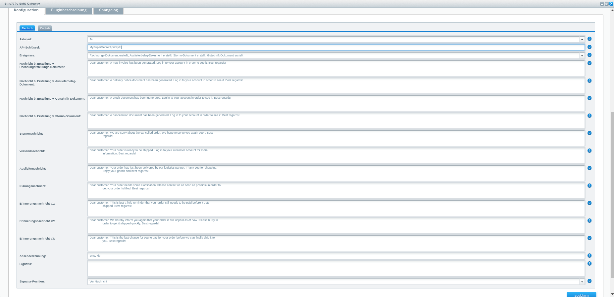

<p align="center">
  
</p>

<h1 align="center">seven SMS for Shopware 5</h1>

<p align="center">
  Event-based SMS notifications for documents, order states and payments in <a href="https://www.shopware.com/">Shopware 5</a> via the seven gateway.
</p>

<p align="center">
  <a href="LICENSE"></a>
  
  
</p>

---

## Features

- **Document Events** - Auto-fire SMS on `INVOICE`, `DELIVERY_NOTICE`, `CREDIT`, `CANCELLATION` document creation
- **Order State Events** - `CANCELLED`, `READY_FOR_DELIVERY`, `COMPLETELY_DELIVERED`, `CLARIFICATION_REQUIRED`
- **Payment Reminder Events** - `1ST_REMINDER`, `2ND_REMINDER`, `3RD_REMINDER`
- **Template Placeholders** - Reference any property of the order entity, e.g. `{{customer->firstname}}`, `{{customer->lastname}}`, `{{id}}`, `{{invoiceAmount}}`

## Template Placeholders

The plugin renders Twig-style placeholders against the `$order` entity. Examples:

```
Dear {{customer->firstname}} {{customer->lastname}}.
A new invoice for order #{{id}} has been generated.
```

`{{customer->firstname}}` resolves to `$order->getCustomer()->getFirstname()`. The root object is `$order`, so `{{invoiceAmount}}` resolves to `$order->getInvoiceAmount()`. Variables are **case-sensitive**.

## Prerequisites

- Shopware 5.x
- PHP 7.2+
- A [seven account](https://www.seven.io/) with API key ([How to get your API key](https://help.seven.io/en/developer/where-do-i-find-my-api-key))

## Installation

### File upload

1. Download the [latest release](https://github.com/seven-io/shopware5/releases/latest).
2. Upload the ZIP via the Plugin Manager and activate the plugin.
3. Enable the plugin from the configuration page.
4. Set an API key and enable the events you need.

### Composer

```bash
cd /path/to/shopware5/root
composer require seven.io/shopware5
```

Then in the Shopware admin:

1. Go to **Configuration > Plugin Manager > Installed**.
2. Click the green install button next to *seven SMS*.
3. Press **Activate**.
4. Set an API key and enable the events you need.



## Support

Need help? Feel free to [contact us](https://www.seven.io/en/company/contact/) or [open an issue](https://github.com/seven-io/shopware5/issues).

## License

[MIT](LICENSE)
