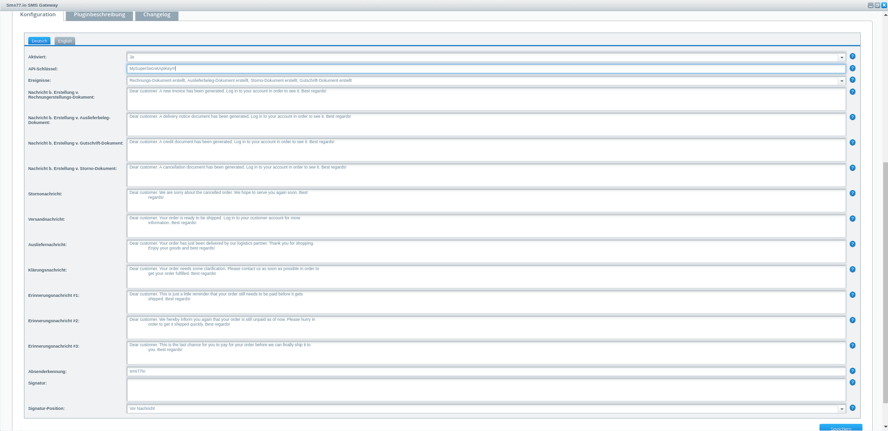

# seven.io Shopware5 Plugin

## About
A Shopware 5 plugin to programmatically make use of the seven.io SMS gateway. 

Currently supported events:
- DOCUMENT_CREATED_INVOICE (via onCreateDocument)
- DOCUMENT_CREATED_DELIVERY_NOTICE (via onCreateDocument)
- DOCUMENT_CREATED_CREDIT (via onCreateDocument)
- DOCUMENT_CREATED_CANCELLATION (via onCreateDocument)
- ORDER_STATE_CANCELLED
- ORDER_STATE_READY_FOR_DELIVERY
- ORDER_STATE_COMPLETELY_DELIVERED
- ORDER_STATE_CLARIFICATION_REQUIRED
- PAYMENT_STATE_1ST_REMINDER
- PAYMENT_STATE_2ND_REMINDER
- PAYMENT_STATE_3RD_REMINDER

Template Placeholders:

Template placeholders are available for programmatically sent messages like this:
Dear {{customer->firstname}} {{customer->lastname}}. A new invoice for order #{{id}} has been generated.
{{customer->firstname}} resolves to $order->getCustomer()->getFirstname() and so on.
The root is the $order, so using {{invoiceAmount}} resolves to $order->getInvoiceAmount().
Be careful as the variables are case-sensitive!

### Installation
#### Via file upload

1. Download the [latest release](https://github.com/seven-io/shopware5-plugin/releases/latest)
2. Upload the *.zip file via the plugin manager and activate it
3. Enable the plugin from the configuration page
4. Set an API key and enable wanted events

#### Via composer
1. Open a terminal and navigate to the root of your Shopware5 installation
2. Running ```composer require seven.io/shopware5``` downloads the latest release
3. Log in to the Shopware backend and navigate to Configuration->Plugin Manager->Installed
4. Click the green install button on the right and wait for the installation to finish
5. Press the activate button in the opened plugin popup
6. Set an API key and enable wanted events



#### License
Please see [License File](LICENSE) for more information.

##### Need help?
You are more than welcome to contact us via [seven.io](https://www.seven.io) in order to get assistance.
